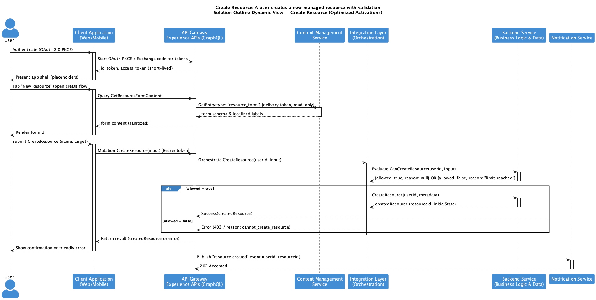

# Architecture As Code

This repository contains architecture as code, using PlantUML to create a series of activity and sequence diagrams that explain each journey. The journeys are organised into reusable components, which can be found in the `components` folder.

## Example Output

Here's an example of a generated sequence diagram showing a resource creation flow:

## Components

The `components` folder contains reusable PlantUML activity and sequence diagram partitions and Markdown design decisions for each component. These components can be used across multiple journeys to ensure consistency and reduce duplication.

## Journeys

The `journeys` folder contains various subfolders, each representing a category of journeys. Within each category folder, there are PlantUML files illustrating the steps involved in each journey.

## Using AI Agents to Create PlantUML Diagrams

AI agents like [Claude Code](https://claude.com/claude-code) can significantly accelerate diagram creation. Describe your architecture or user journey in natural language, and the AI can generate PlantUML code following your project's patterns and themes. This is particularly useful for:

- Rapidly prototyping new sequence diagrams from architectural discussions
- Ensuring consistency with existing diagram styles and conventions
- Converting architecture documentation into visual diagrams
- Refactoring or updating existing diagrams when requirements change

The AI can read your existing diagrams and theme files to maintain visual consistency across your entire architecture documentation.

> **Data privacy:** Before sharing architecture diagrams or details with AI agents, review your organisation’s data-privacy policies and any applicable legal requirements. Anonymise or remove any sensitve data and ensure appropriate security and contractual safeguards are in place.

# Pre-Requisites

## Java

Java 11 or later is required to run PlantUML.

## VSCode Extensions

Accept the recommendations suggested by VSCode on launch.

# Generate Diagrams

The `generate_diagrams` tool is a script that automates the process of generating PlantUML diagrams from the `journeys` folder. The script searches for `DynamicView.puml` and `StaticView.puml` files, generates the corresponding diagrams, and saves them in the `builds` folder, maintaining the folder structure of the `journeys` directory.

## How to Use the Generate Diagrams Tool

1. Make sure you have Java installed on your system.
2. Navigate to the root directory of the project in your terminal.
3. Run the following command `./tools/generate_diagrams.sh`

The script will generate the diagrams and save them in the `builds` folder. If you encounter any issues while running the script, please check the terminal for any error messages and ensure you have the required permissions to create and write to the `builds` directory.
